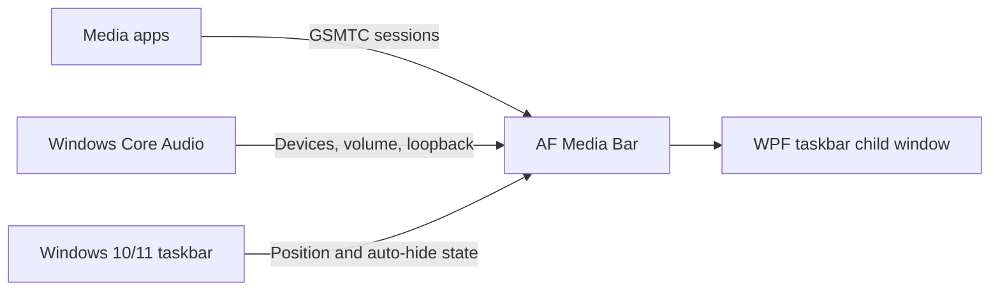

# AF Media Bar

<div align="center">

  <a href="https://github.com/Fervent-Tempo/AF-Media-Bar/releases"></a>
  <a href="https://github.com/Fervent-Tempo/AF-Media-Bar/releases"></a>
  <a href="https://github.com/Fervent-Tempo/AF-Media-Bar/stargazers"></a>
  <a href="LICENSE"></a>

  <br><br>

  

  <h1>AF Media Bar</h1>

  <p>Media controls, live lyrics, audio device switching, and lightweight system metrics on the Windows 10/11 taskbar.</p>

  <p>
    <a href="README.md">简体中文</a> · English
    <br>
    <a href="#installation">Quick start</a> ·
    <a href="https://github.com/Fervent-Tempo/AF-Media-Bar/issues/new?template=bug_report.yml">Report a bug</a> ·
    <a href="https://github.com/Fervent-Tempo/AF-Media-Bar/issues/new?template=feature_request.yml">Request a feature</a>
  </p>

</div>

## Demo

<div align="center">


</div>

[Watch the AF Media Bar introduction video on Bilibili](https://www.bilibili.com/video/BV1Bjuq6bErr)

## Overview

AF Media Bar is a portable media controller for Windows 10 and Windows 11. It reads Windows Global System Media Transport Controls (GSMTC) sessions and puts artwork, title, artist, and live lyrics on the taskbar, together with previous, play/pause, next, and source switching; audio devices, per-app volume, spatial audio, and system metrics live in the same interface.

The app runs in its own process and hosts its WPF bar as a taskbar child window. It does not modify or inject code into `explorer.exe`. Any player that publishes a GSMTC session can be discovered and controlled — NetEase Cloud Music, QQ Music, Spotify, major browsers, and others.

## Features

| Category | Capabilities |
| --- | --- |
| Media | Previous, play/pause, next, repeat, and click-to-position or draggable progress |
| Source interaction | Bind artwork and title/lyric clicks independently to play/pause, activate the media app, or open the full menu |
| Live lyrics | Lyrics appear directly on the taskbar with syllable-by-syllable reveal, translation, romanization, and two-line alignment; sources are matched in order across NetEase Cloud Music, LRCLIB, QQ Music, Kugou Music, and Soda Music |
| Taskbar behavior | Docked as a taskbar child window that avoids icons and system areas; the target display is selectable, and the bar can auto-hide while nothing plays |
| Appearance | Global fonts, font size, light/dark theme, window material, and material concentration; the accent colour follows the system and can also be picked or entered as hex |
| Layered information | Hover shows the control buttons; the full layer shows every piece of information |
| Audio output | Click and wheel switch quickly between the default output device, the current media app's volume, and spatial audio |
| Quick launch | With nothing playing, click or scroll the note icon to open the quick-launch list |
| Spectrum and metrics | Four spectrum styles and a performance metrics component |
| Now-playing notification | A notification appears when a track changes and starts playing |

A media app only appears once it publishes a GSMTC session; some players need "system media controls" or "media keys" enabled in their own settings. Taskbar is the only runtime mode: Dynamic Island, Desktop Card, and Floating Orb in Settings are placeholders that only change the page area.

## How It Works



The Windows 10/11 media card is an internal Explorer/Shell surface rather than a supported embeddable control. AF Media Bar uses the public GSMTC API behind it and renders its own interface, avoiding the stability and security risks of injecting into Explorer.

## Installation

### Requirements

- Windows 10 version 1809 (build 17763) or later, x64; both the installer and the portable package are self-contained, so no separate .NET installation is needed.
- Every system interface the app uses is available on 1809, but there is one limit beyond that: **.NET 10 officially supports only the Windows 10 LTSC and Enterprise editions** (1809 E, 21H2 E). Consumer Windows 10 still runs, it is just outside Microsoft support. Windows 11 is unaffected.

### Option 1: installer (recommended)

1. Download `AFMediaBar-Setup-vX.Y.Z-win-x64.exe` from [Releases](https://github.com/Fervent-Tempo/AF-Media-Bar/releases); do not use GitHub's generated source archives.
2. The wizard first asks for **Simplified Chinese or English**, then shows the license and lets you **choose the install location** and install for the current user or for all users (default `%LOCALAPPDATA%\Programs\AFMediaBar`, no administrator rights needed).
3. A desktop shortcut is optional, the Start menu entry is always created, and updates can be checked, downloaded, and installed silently from inside the app.

### Option 2: portable package

1. Download `AFMediaBar-vX.Y.Z-win-x64.zip` from the same Releases page.
2. Unzip it into a long-lived writable folder such as `D:\AFMediaBar` and run the single self-contained `AFMediaBar.exe`; the portable build writes no registry entries, so upgrades mean replacing the file.

Both packages are published on GitHub Releases only. Where GitHub is unreliable, the same page offers GH-Proxy accelerated links (`https://<accelerator>/https://github.com/...`), and the in-app update check and download switch to the accelerators automatically when the direct connection fails.

AF Media Bar is not commercially code-signed, so Windows SmartScreen may warn about an unknown publisher on first run or install.

## Updating and Uninstalling

### Updating

About 20 seconds after launch the app reads the public version manifest (`docs/latest.json`). When a newer version exists:

- The tray icon shows one system notification whose click opens the Application page, and the tray and media-bar context menus gain a state-aware update entry.
- That page shows the highlights, the download progress, and every update action.
- Downloads try GitHub directly first and offer both a GitHub and an accelerated download page. The portable build has no install record, so it only downloads.

The install log is written to `%LOCALAPPDATA%\AFMediaBar\updates\install-<version>.log`, and downloaded installers live in the same folder, cleaned up by version on the next launch.

Preferences and window state live in `%LOCALAPPDATA%\AFMediaBar\settings.json`; replacing the program files within one version never loses settings, and the Application page opens the settings folder.

### Uninstalling

- Portable build: delete the program folder.
- Installed build: uninstall from Settings > Apps > Installed apps or the Start menu entry; that removes only the program folder and the shortcuts, so `%LOCALAPPDATA%\AFMediaBar` has to be removed with the command below or by hand.

```powershell
Remove-Item "$env:LOCALAPPDATA\AFMediaBar" -Recurse -Force
```

## Privacy and Security

- No telemetry, ads, account system, or analytics; media information, system metrics, and volume operations are all handled locally.
- The update check requests two public manifest endpoints (`docs/latest.json` on `raw.githubusercontent.com` and jsDelivr) and never goes through a third-party proxy; an installer may be fetched through the accelerators configured in the manifest, and its SHA-256 always comes from the manifest read through a non-proxy endpoint.
- Lyrics are requested from the public endpoints of the five sources above (one request per source, stopping at the first hit) and send only title, artist, album, and duration — no device information and no settings.
- The app runs with the current user's rights, requests no elevation, and injects nothing into Explorer. Report security issues privately as described in [SECURITY.md](SECURITY.md).

## Building from Source

Windows 10 1809 or later, the [.NET 10 SDK](https://dotnet.microsoft.com/download/dotnet/10.0), and PowerShell are required; the repository pins the supported SDK feature band through `global.json`.

```powershell
git clone https://github.com/Fervent-Tempo/AF-Media-Bar.git
cd AF-Media-Bar
dotnet restore .\src\AFMediaBar.slnx
dotnet build .\src\AFMediaBar.slnx -c Release --no-restore
dotnet test .\src\AFMediaBar.slnx -c Release --no-build
dotnet run --project .\src\AFMediaBar\AFMediaBar.csproj
```

To produce the self-contained single file users download:

```powershell
dotnet publish .\src\AFMediaBar\AFMediaBar.csproj -c Release -r win-x64 --self-contained true -o .\artifacts\AFMediaBar-win-x64
```

## Project Structure

```text
AF-Media-Bar/
├── .github/workflows/        # Build and release workflows
├── src/AFMediaBar/           # The WPF application
│   ├── Classes/              # Layered application code
│   │   ├── Abstractions/     # Cross-module contracts
│   │   ├── Interop/          # Windows API interop
│   │   ├── Models/           # Data models, layout schema included
│   │   ├── Services/         # Ownership-scoped services (Media, Lyrics, Audio, Updates…)
│   │   ├── Settings/         # Settings model and compatibility facade
│   │   └── Utils/            # Stateless helpers and bounded caches
│   ├── Components/           # Reusable WPF controls
│   ├── Resources/            # Theme, styles, and three-language strings
│   ├── ViewModels/           # MVVM view models
│   └── Views/                # Pages and host windows
├── tests/AFMediaBar.Layout.Tests/   # Pure-logic, policy, and settings tests
├── tools/                    # Architecture static checks and helper scripts
├── installer/                # Inno Setup script
└── docs/                     # Documentation, assets, and the version manifest
```

## Contributing

Read [CONTRIBUTING.md](CONTRIBUTING.md) before opening an issue or a pull request. Bug reports should include the Windows version, the AF Media Bar version, the media player, and exact reproduction steps. Changes are recorded in [CHANGELOG.md](CHANGELOG.en-US.md).

## License

AF Media Bar is released under the [MIT License](LICENSE).

<div align="center">

If AF Media Bar helps you, a Star is appreciated ❤️

</div>

## Sponsor

Buy me a coffee. **Sponsorships above 10 CNY can join the sponsor list — please leave your ID in the payment note.**

<div align="center">

| WeChat | Alipay |
| :---: | :---: |
|  |  |

My Afdian: [Afdian](https://ifdian.net/a/amorfate)

</div>
