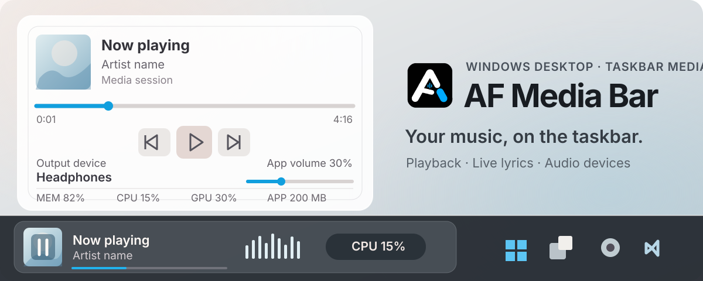
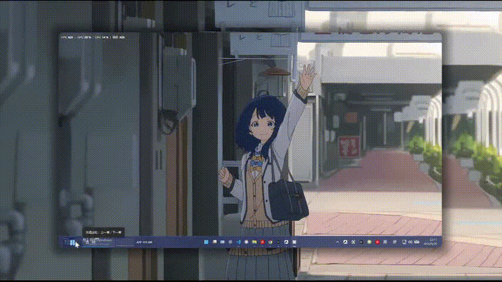
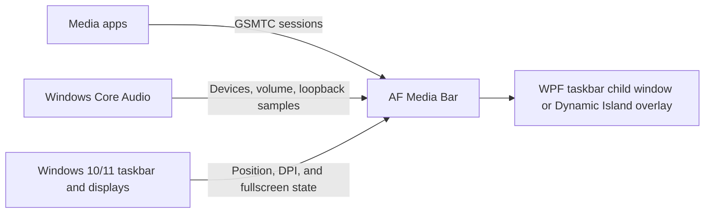

<p align="center">
  
</p>

<p align="center">
  <a href="https://github.com/Fervent-Tempo/AF-Media-Bar/releases"></a>
  <a href="https://github.com/Fervent-Tempo/AF-Media-Bar/releases"></a>
  <a href="LICENSE"></a>
  <br>
  <a href="README.md">简体中文</a> · English
  <br>
  <a href="#download-and-run">Download</a> · <a href="#features">Features</a> · <a href="https://github.com/Fervent-Tempo/AF-Media-Bar/issues/new?template=bug_report.yml">Report a bug</a> · <a href="https://github.com/Fervent-Tempo/AF-Media-Bar/issues/new?template=feature_request.yml">Request a feature</a>
</p>

AF Media Bar is a portable media controller for the Windows 10/11 taskbar. It reads the system media session and keeps artwork, lyrics, playback controls, and audio device switching at the edge of your desktop.

## Live demo

<p align="center">
  
</p>

[Watch the introduction video on Bilibili](https://www.bilibili.com/video/BV17yhh6aEgK)

## Download and run

Open [GitHub Releases](https://github.com/Fervent-Tempo/AF-Media-Bar/releases) and choose a package:

1. **Installer (recommended):** Download `AFMediaBar-Setup-vX.Y.Z-win-x64.exe`. Run the wizard to choose language, install location, and current-user or all-user installation. The default location is `%LOCALAPPDATA%\Programs\AFMediaBar`. The installed app supports checking for, downloading, and installing updates.
2. **Portable:** Download `AFMediaBar-vX.Y.Z-win-x64.zip`. Extract it to a writable, long-lived folder such as `D:\AFMediaBar`, then run `AFMediaBar.exe`. The portable build writes no registry entries; replace the file manually to update.

**Requirements:** Windows 10 1809 (build 17763) or later, x64. Both packages include the .NET runtime. The system interfaces used by the app are available on 1809, but **.NET 10 officially supports only Windows 10 LTSC and Enterprise editions** (1809 E and 21H2 E); consumer Windows 10 is outside Microsoft support. Windows 11 is unaffected.

Download a release package rather than GitHub's generated Source code archive. The app is not commercially code-signed, so Windows SmartScreen may show an unknown-publisher warning on first run.

The installer offers an optional desktop shortcut and always creates a Start menu entry. If GitHub access is unreliable, accelerated GH-Proxy links are available on the Releases page; in-app updates also try an accelerator if a direct connection fails.

## Features

| Area | What you can do |
| --- | --- |
| Playback | Previous, play/pause, next, repeat, and click-to-position or draggable progress. Wheel track skipping moves one track at a time; pause for about half a second before another skip |
| Taskbar lyrics | Syllable-by-syllable live lyrics with translation, romanization, and two-line alignment; sources are tried in order: NetEase Cloud Music, LRCLIB, QQ Music, Kugou Music, and Soda Music |
| Sources and clicks | Switch media sessions; assign artwork and title/lyric clicks to play/pause, activate the media app, or open the full menu |
| Audio and system | Click or scroll to switch the default output device, adjust the current media app's volume, and view spatial audio; four spectrum styles and a performance metrics component |
| Layout and appearance | Avoid taskbar icons and system areas; select a display, auto-hide when nothing plays, and adjust fonts, accent colour, and window material |
| Shortcuts | Hover for controls, open the full layer for more information, use the note icon for quick launch when idle, and receive a notification when a new track starts |
| Display modes | Switch and persist between Taskbar and Dynamic Island; the island is a black top-center capsule with press-and-hold controls, its own display selection, and uniform scale |

**Limits:** Only players that publish a Windows GSMTC session appear. Some players require “system media controls” or “media keys” in their settings. Taskbar and Dynamic Island are both runtime modes and the choice persists. Desktop Card and Floating Orb remain disabled, unimplemented options.

### Dynamic Island Interaction

- With no media, a static black capsule remains. Connected media adds small artwork and an audio activity indicator. Pausing retains the media; the island neither slides off-screen nor expands on hover.
- Quickly tap the compact island to activate the media app. Holding progressively opens it from its current shape and commits after about 400 ms; abandoning a hold smoothly springs back without also opening the app. Artwork, text, progress, and controls enter in stages. Releasing a completed hold keeps it open. Click outside or press Esc to collapse; seeking supports pressing anywhere on the track and dragging continuously.
- One surface morphs between states, carrying the same artwork with it. Reversing a transition preserves continuity. Track changes update the current presentation without forcing expansion or a second track-change toast.
- Choose an independent target display and uniform scale from 75% to 150%. Placement is fixed at the top center; free dragging, vertical layouts, and four-edge docking are no longer exposed. Legacy surface and dragged-position fields remain only for settings-file compatibility.
- An external fullscreen window on the island's display temporarily suppresses it; leaving fullscreen restores it. The island does not steal focus, its transparent host area does not block desktop input, and system reduced-motion/high-contrast preferences are respected.
- The activity indicator reuses real samples from the existing output-device capture, not isolated audio from a single media app. It stays still when paused or samples are unavailable. Lyrics remain a taskbar feature rather than part of the island's default presentation.
- Visible metadata does not imply a controllable session. If NetEase supplies memory-read metadata without publishing a Windows media session, playback/track buttons remain disabled with an explanation. Start playback in the player or enable its system-media integration if that version supports it. The app does not broadcast global media keys to an uncertain target.

## How it works

AF Media Bar runs as an independent WPF process and hosts its media bar either as a taskbar child window or as a Dynamic Island overlay. It uses the public Windows GSMTC API for media sessions and Core Audio for devices, volume, and loopback samples. It does not modify or inject code into `explorer.exe`.



NetEase Cloud Music, QQ Music, Spotify, browsers, and other apps can be discovered and controlled when they publish a system media session. The Windows media card is not a public embeddable control; this app reads the public interface behind it and draws its own taskbar UI.

## Updating and Uninstalling

### Updating

About 20 seconds after launch the app reads the public version manifest (`docs/latest.json`). When a newer version exists:

- The tray icon shows one system notification whose click opens the Application page, and the tray and media-bar context menus gain a state-aware update entry.
- That page shows the highlights, the download progress, and every update action.
- Downloads try GitHub directly first and offer both a GitHub and an accelerated download page. The portable build has no install record, so it only downloads.

The install log is written to `%LOCALAPPDATA%\AFMediaBar\updates\install-<version>.log`, and downloaded installers live in the same folder, cleaned up by version on the next launch.

Preferences and window state live in `%LOCALAPPDATA%\AFMediaBar\settings.json`; replacing the program files within one version never loses settings, and the Application page opens the settings folder.

### Uninstalling

- Portable build: delete the program folder.
- Installed build: uninstall from Settings > Apps > Installed apps or the Start menu entry; that removes only the program folder and the shortcuts, so `%LOCALAPPDATA%\AFMediaBar` has to be removed with the command below or by hand.

```powershell
Remove-Item "$env:LOCALAPPDATA\AFMediaBar" -Recurse -Force
```

## Privacy and Security

- No telemetry, ads, account system, or analytics; media information, system metrics, and volume operations are all handled locally.
- The update check requests two public manifest endpoints (`docs/latest.json` on `raw.githubusercontent.com` and jsDelivr) and never goes through a third-party proxy; an installer may be fetched through the accelerators configured in the manifest, and its SHA-256 always comes from the manifest read through a non-proxy endpoint.
- Lyrics are requested from the public endpoints of the five sources above (one request per source, stopping at the first hit) and send only title, artist, album, and duration — no device information and no settings.
- The app runs with the current user's rights, requests no elevation, and injects nothing into Explorer. Report security issues privately as described in [SECURITY.md](SECURITY.md).

## Building from Source

Windows 10 1809 or later, the [.NET 10 SDK](https://dotnet.microsoft.com/download/dotnet/10.0), and PowerShell are required; the repository pins the supported SDK feature band through `global.json`.

```powershell
git clone https://github.com/Fervent-Tempo/AF-Media-Bar.git
cd AF-Media-Bar
dotnet restore .\src\AFMediaBar.slnx
dotnet build .\src\AFMediaBar.slnx -c Release --no-restore
dotnet test .\src\AFMediaBar.slnx -c Release --no-build
dotnet run --project .\src\AFMediaBar\AFMediaBar.csproj
```

To produce the self-contained single file users download:

```powershell
dotnet publish .\src\AFMediaBar\AFMediaBar.csproj -c Release -r win-x64 --self-contained true -o .\artifacts\AFMediaBar-win-x64
```

## Project Structure

```text
AF-Media-Bar/
├── .github/workflows/        # Build and release workflows
├── src/AFMediaBar/           # The WPF application
│   ├── Classes/              # Layered application code
│   │   ├── Abstractions/     # Cross-module contracts
│   │   ├── Interop/          # Windows API interop
│   │   ├── Models/           # Data models, layout schema included
│   │   ├── Services/         # Ownership-scoped services (Media, Lyrics, Audio, Updates…)
│   │   ├── Settings/         # Settings model and compatibility facade
│   │   └── Utils/            # Stateless helpers and bounded caches
│   ├── Components/           # Reusable WPF controls
│   ├── Resources/            # Theme, styles, and three-language strings
│   ├── ViewModels/           # MVVM view models
│   └── Views/                # Pages and host windows
├── tests/AFMediaBar.Layout.Tests/   # Pure-logic, policy, and settings tests
├── tools/                    # Architecture static checks and helper scripts
├── installer/                # Inno Setup script
└── docs/                     # Documentation, assets, and the version manifest
```

## Contributing

Read [CONTRIBUTING.md](CONTRIBUTING.md) before opening an issue or a pull request. Bug reports should include the Windows version, the AF Media Bar version, the media player, and exact reproduction steps. Changes are recorded in [CHANGELOG.md](CHANGELOG.en-US.md).

## License

AF Media Bar is released under the [MIT License](LICENSE).

<div align="center">

If AF Media Bar helps you, a Star is appreciated ❤️

</div>

## Sponsor

Buy me a coffee. **Sponsorships above 10 CNY can join the sponsor list — please leave your ID in the payment note.**

<div align="center">

| WeChat | Alipay |
| :---: | :---: |
|  |  |

My Afdian: [Afdian](https://ifdian.net/a/amorfate)

</div>
