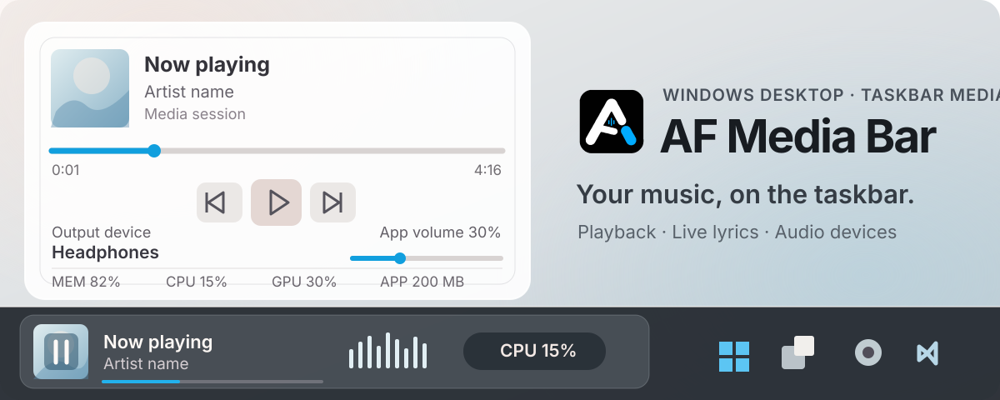
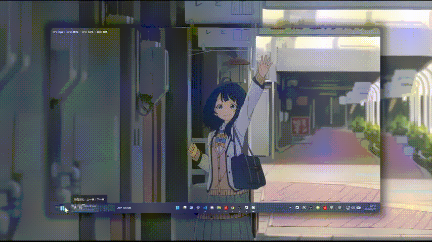
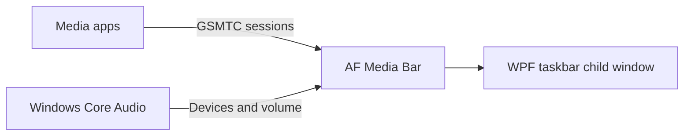

<p align="center">
  
</p>

<p align="center">
  <a href="https://github.com/Fervent-Tempo/AF-Media-Bar/releases"></a>
  <a href="https://github.com/Fervent-Tempo/AF-Media-Bar/releases"></a>
  <a href="LICENSE"></a>
  <br>
  <a href="README.md">简体中文</a> · English
  <br>
  <a href="#download-and-run">Download</a> · <a href="#features">Features</a> · <a href="https://github.com/Fervent-Tempo/AF-Media-Bar/issues/new?template=bug_report.yml">Report a bug</a> · <a href="https://github.com/Fervent-Tempo/AF-Media-Bar/issues/new?template=feature_request.yml">Request a feature</a>
</p>

AF Media Bar is a portable media controller for the Windows 10/11 taskbar. It reads the system media session and keeps artwork, lyrics, playback controls, and audio device switching at the edge of your desktop.

## Live demo

<p align="center">
  
</p>

[Watch the introduction video on Bilibili](https://www.bilibili.com/video/BV17yhh6aEgK)

## Download and run

Open [GitHub Releases](https://github.com/Fervent-Tempo/AF-Media-Bar/releases) and choose a package:

1. **Installer (recommended):** Download `AFMediaBar-Setup-vX.Y.Z-win-x64.exe`. Run the wizard to choose language, install location, and current-user or all-user installation. The default location is `%LOCALAPPDATA%\Programs\AFMediaBar`. The installed app supports checking for, downloading, and installing updates.
2. **Portable:** Download `AFMediaBar-vX.Y.Z-win-x64.zip`. Extract it to a writable, long-lived folder such as `D:\AFMediaBar`, then run `AFMediaBar.exe`. Replace the file manually to update; enabling run-at-startup writes a startup entry in the current user's registry.

**Run at startup:** Each launch synchronizes the Application page's switch with the Run entry for the current executable path. A missing entry or an old path turns the switch off without automatic repair; enable it manually to register the current path. If the entry cannot be read, the saved setting remains with an unknown-state message. Changing the switch or resetting all settings applies the corresponding registration choice. This state does not include Windows' startup-app disable status, and the app does not undo a disable made in Windows. Moving the executable while it is not running also prevents it from repairing its old entry itself.

**Requirements:** Windows 10 1809 (build 17763) or later, x64, plus Microsoft Edge WebView2 Runtime. Windows 11 and supported Windows 10 installations normally include it; stripped-down systems must install the Evergreen Runtime first. Both packages include the .NET runtime. The system interfaces used by the app are available on 1809, but **.NET 10 officially supports only Windows 10 LTSC and Enterprise editions** (1809 E and 21H2 E); consumer Windows 10 is outside Microsoft support. Windows 11 is unaffected.

Download a release package rather than GitHub's generated Source code archive. The app is not commercially code-signed, so Windows SmartScreen may show an unknown-publisher warning on first run.

## Features

| Area | What you can do |
| --- | --- |
| Playback | Previous, play/pause, next, repeat, and click-to-position or draggable progress. |
| Taskbar lyrics | Live lyrics rendered by the web lyrics engine, with translation, romanization, and two-line alignment; enabled QQ Music is searched first and a result scoring at least 75 is accepted immediately; otherwise fallbacks are queried in parallel and the enabled source matching the current player wins regardless of score; without such a result, the highest score wins and ties favor QQ, including confirmed absence of lyrics |
| Sources and clicks | Switch media sessions; assign artwork and title/lyric clicks to play/pause, activate the media app, or open the full menu |
| Audio and system | Click or scroll to switch the default output device, adjust the current media app's volume, and view spatial audio; four spectrum styles and a performance metrics component |
| Layout and appearance | Avoid taskbar icons and system areas; select a display, auto-hide when nothing plays, and adjust fonts, accent colour, and window material |
| Shortcuts | Hover for controls, open the full layer for more information, use the note icon or the media bar and tray context menus for quick launch, and quickly switch output devices |

**Limits:** Most players need to publish a Windows GSMTC session; some require “system media controls” or “media keys” in their settings. NetEase Cloud Music can also be discovered through memory reading, including the Store version without SMTC. Memory data takes priority for track information and lyrics; artwork and playback controls require its SMTC support. Artwork is read only from SMTC, without separate downloads; no artwork is shown when SMTC has none for the same track. NetEase appears once in the source list, and hiding it with source filtering enabled stops memory reading. Taskbar is the only runtime mode; Dynamic Island, Desktop Card, and Floating Orb in Settings are placeholders.

## How it works

AF Media Bar runs as an independent WPF process and hosts its media bar as a taskbar child window. It uses the public Windows GSMTC API for media sessions and Core Audio for devices and volume. It does not modify or inject code into `explorer.exe`.


```mermaid
flowchart LR
    A[Media apps] -->|GSMTC sessions| B[AF Media Bar]
    C[Windows Core Audio] -->|Devices and volume| B
    B --> D[WPF taskbar child window]
```

NetEase Cloud Music, QQ Music, Spotify, browsers, and other apps can be discovered and controlled when they publish a system media session. The Windows media card is not a public embeddable control; this app reads the public interface behind it and draws its own taskbar UI.

## Updating and Uninstalling

### Updating

About 20 seconds after launch the app reads the stable manifest (`release/latest.json`) on the isolated `release-metadata` branch. When a newer version exists, the tray icon shows one system notification whose click opens the Application page. Release Actions generate metadata automatically; review and stable promotion control when it becomes active. If `main/docs/latest.json` is retained, synchronization PRs update it for older clients. See the [Release CI](.github/workflows/release.yml).

Release CI also generates contributor snapshots, reviewed alongside version manifests at `release-metadata/release/contributors.json`. The app still tries the GitHub contributors API first and falls back to that snapshot; synchronization PRs maintain `docs/contributors.json` on main for compatibility. The sponsor list, `docs/sponsors.json`, remains manually maintained on main.
The portable build has no install record, so it only downloads.

The install log is written to `%LOCALAPPDATA%\AFMediaBar\updates\install-<version>.log`, and downloaded installers live in the same folder, cleaned up by version on the next launch.

Preferences and window state live in `%LOCALAPPDATA%\AFMediaBar\settings.json`; replacing the program files within one version never loses settings, and the Application page opens the settings folder.

### Uninstalling

- Portable build: delete the program folder.
- Installed build: uninstall from Settings > Apps > Installed apps or the Start menu entry; that removes only the program folder and the shortcuts, so `%LOCALAPPDATA%\AFMediaBar` has to be removed with the command below or by hand.

```powershell
Remove-Item "$env:LOCALAPPDATA\AFMediaBar" -Recurse -Force
```

## Privacy and Security

- No telemetry, ads, account system, or analytics; media information, system metrics, and volume operations are all handled locally.
- The update check requests two public manifest endpoints (`release-metadata/release/latest.json` on `raw.githubusercontent.com` and jsDelivr).
- Lyrics search QQ Music and request its online lyrics first; a result scoring at least 75 is accepted immediately. Otherwise QQ results are retained while fallbacks are queried in parallel. An enabled lyric source matching the current player wins regardless of score; if it is disabled, fails, or returns no result, the highest score wins, with ties favoring QQ. Online searches use track and artist metadata; a source may make multiple requests for search and lyric retrieval. Sources can be disabled in Settings.
- The app runs with the current user's rights and requests no elevation. Report security issues privately as described in [SECURITY.md](SECURITY.md).

## Building from Source

Windows 10 1809 or later, the [.NET 10 SDK](https://dotnet.microsoft.com/download/dotnet/10.0), and PowerShell are required; the repository pins the supported SDK feature band through `global.json`.

```powershell
git clone https://github.com/Fervent-Tempo/AF-Media-Bar.git
cd AF-Media-Bar
dotnet restore .\src\AFMediaBar.slnx
dotnet build .\src\AFMediaBar.slnx -c Release --no-restore
dotnet test .\src\AFMediaBar.slnx -c Release --no-build
dotnet run --project .\src\AFMediaBar\AFMediaBar.csproj
```

To produce the self-contained single file users download:

```powershell
dotnet publish .\src\AFMediaBar\AFMediaBar.csproj -c Release -r win-x64 --self-contained true -o .\artifacts\AFMediaBar-win-x64
```

## Project Structure

```text
AF-Media-Bar/
├── .github/workflows/        # Build and release workflows
├── src/AFMediaBar/           # The WPF application
│   ├── Classes/              # Layered application code
│   │   ├── Abstractions/     # Cross-module contracts
│   │   ├── Interop/          # Windows API interop
│   │   ├── Models/           # Data models, layout schema included
│   │   ├── Services/         # Ownership-scoped services (Media, Lyrics, Audio, Updates…)
│   │   ├── Settings/         # Settings model and compatibility facade
│   │   └── Utils/            # Stateless helpers and bounded caches
│   ├── Components/           # Reusable WPF controls
│   ├── Resources/            # Theme, styles, and three-language strings
│   ├── ViewModels/           # MVVM view models
│   └── Views/                # Pages and host windows
├── tests/AFMediaBar.Layout.Tests/   # Pure-logic, policy, and settings tests
├── tools/                    # Architecture static checks and helper scripts
├── installer/                # Inno Setup script
└── docs/                     # Documentation, assets, and the version manifest
```

## Contributing

Read the [contribution guide and project direction](CONTRIBUTING.md) before opening an issue or a pull request. Bug reports should include the Windows version, the AF Media Bar version, the media player, and exact reproduction steps. Changes are recorded in [CHANGELOG.md](CHANGELOG.en-US.md).


## Acknowledgements

Thank you to all the developers who have contributed to AF Media Bar.

Thanks to the following open-source projects:

- [FluentFlyout](https://github.com/unchihugo/FluentFlyout): A simple, modern Windows volume flyout.
- [Lyricify-Lyrics-Helper](https://github.com/WXRIW/Lyricify-Lyrics-Helper): A Lyricify lyrics library for parsing, generating, searching, decrypting, and refining lyrics.
- [TaskbarLyrics](https://github.com/ANYNC/TaskbarLyrics): A Windows taskbar lyrics tool.


## License

AF Media Bar is released under the [MIT License](LICENSE).

<div align="center">

If AF Media Bar helps you, a Star is appreciated ❤️

</div>

## Sponsor

Buy me a coffee. **Sponsorships above 10 CNY can join the sponsor list — please leave your ID in the payment note.**

<div align="center">

| WeChat | Alipay |
| :---: | :---: |
|  |  |

</div>
