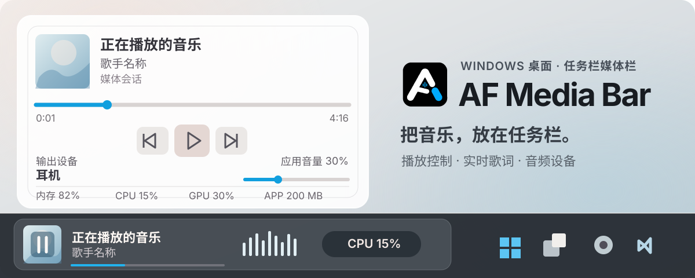
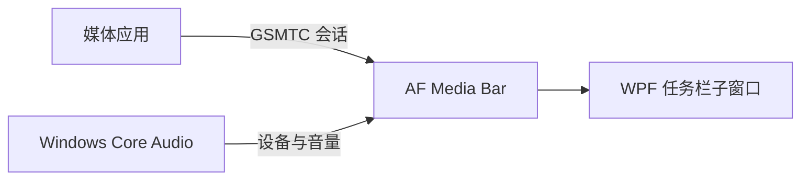

<p align="center">
  
</p>

<p align="center">
  <a href="https://github.com/Fervent-Tempo/AF-Media-Bar/releases"></a>
  <a href="https://github.com/Fervent-Tempo/AF-Media-Bar/releases"></a>
  <a href="LICENSE"></a>
  <br>
  简体中文 · <a href="README.en-US.md">English</a>
  <br>
  <a href="#下载安装">下载运行</a> · <a href="#功能一览">功能一览</a> · <a href="https://github.com/Fervent-Tempo/AF-Media-Bar/issues/new?template=bug_report.yml">报告问题</a> · <a href="https://github.com/Fervent-Tempo/AF-Media-Bar/issues/new?template=feature_request.yml">功能建议</a>
</p>

AF Media Bar 是一款便携式 Windows 10/11 任务栏媒体控制器。它从系统媒体会话读取正在播放的内容，让封面、歌词、播放控制和音频设备切换留在桌面边缘。

## 运行演示

<p align="center">
  
</p>

[观看 Bilibili 介绍视频](https://www.bilibili.com/video/BV17yhh6aEgK)

## 下载安装

前往 [GitHub Releases](https://github.com/Fervent-Tempo/AF-Media-Bar/releases)，选择一种方式：

1. **安装程序（推荐）：** 下载 `AFMediaBar-Setup-vX.Y.Z-win-x64.exe`，运行向导并选择语言、安装位置及当前用户/所有用户。默认安装位置为 `%LOCALAPPDATA%\Programs\AFMediaBar`；安装版支持程序内检查、下载与安装更新。
2. **便携版：** 下载 `AFMediaBar-vX.Y.Z-win-x64.zip`，解压到长期保留且可写的目录（如 `D:\AFMediaBar`），运行其中的 `AFMediaBar.exe`。便携版不写注册表，更新时手动替换文件。

**系统要求：** Windows 10 1809（内部版本 17763）或更新的 x64 系统，并需要 Microsoft Edge WebView2 Runtime。Windows 11 与仍受支持的 Windows 10 通常已预装；精简系统若缺失，需先安装 Evergreen Runtime。两种包都自带 .NET 运行时，不需要另行安装。程序用到的系统接口可在 1809 使用，但 **.NET 10 官方仅支持 Windows 10 的长期服务版与企业版**（1809 E、21H2 E）；消费版 Windows 10 不在 Microsoft 的支持范围内。Windows 11 不受此限制。

请下载上述发布包，不要使用 GitHub 自动生成的 Source code 压缩包。程序尚未进行商业代码签名，首次运行时 Windows SmartScreen 可能提示“未知发布者”。


## 功能一览

| 场景 | 可以做什么 |
| --- | --- |
| 音乐控制 | 上一首、播放/暂停、下一首、循环；点击或拖动进度条跳转。 |
| 任务栏歌词 | 由 Web 歌词引擎显示实时歌词，支持译文、音译与双行对齐；按网易云音乐、LRCLIB、QQ 音乐、酷狗音乐、汽水音乐的顺序匹配 |
| 来源与交互 | 切换媒体会话；封面、标题与歌词的点击操作可分别设为播放/暂停、切回媒体应用或打开完整菜单 |
| 音频与系统 | 点击或滚轮切换默认输出设备、调整当前媒体应用音量、查看空间音效；提供四种频谱样式与性能检测组件 |
| 布局与外观 | 自动避让任务栏图标及系统区域，可选目标屏幕、无播放时自动隐藏；可调字体、主题色与窗口材质 |
| 快捷操作 | 悬停显示控制按钮，完整层展示更多信息；音符图标打开快速启动列表；快速切换输出设备 |

**使用边界：** 只有向 Windows 发布 GSMTC 媒体会话的播放器才会出现；部分播放器需要在自身设置中启用“系统媒体控制”或“媒体键”。当前仅有任务栏运行模式；设置中的灵动岛、桌面卡片、悬浮球是占位选项。

## 工作方式

AF Media Bar 以独立 WPF 进程运行，将媒体栏挂载为任务栏子窗口。它使用 Windows 的公开 GSMTC 接口读取媒体会话，通过 Core Audio 处理设备与音量，不修改或向 `explorer.exe` 注入代码。



网易云音乐、QQ 音乐、Spotify、浏览器等应用只要发布系统媒体会话，就可以被发现和控制。Windows 控制中心的媒体卡片不是公开可嵌入的控件；本项目读取其背后的公开接口并自行渲染任务栏界面。

## 更新与卸载

### 更新

程序启动约 20 秒后读取公开版本清单（`docs/latest.json`）。发现新版本时：托盘图标弹出一次系统通知，点击直接打开「应用」页。
便携版没有安装记录，只下载不安装。

安装日志在 `%LOCALAPPDATA%\AFMediaBar\updates\install-<版本>.log`；已下载的安装包放在同一目录，并在下次启动时按版本清理。

用户偏好与窗口状态保存在 `%LOCALAPPDATA%\AFMediaBar\settings.json`，同一版本内替换程序文件不会丢失设置；「应用」页可打开设置文件夹。

### 卸载

- 便携版：直接删除程序目录。
- 安装版：在“设置 > 应用 > 已安装的应用”中卸载，或使用开始菜单的卸载项；卸载只删除程序目录与快捷方式，需要使用下面命令或手动删除 `%LOCALAPPDATA%\AFMediaBar`。

```powershell
Remove-Item "$env:LOCALAPPDATA\AFMediaBar" -Recurse -Force
```

## 隐私与安全

- 不包含遥测、广告、账号系统或联网分析代码；媒体信息、系统指标与音量操作全部在本机处理。
- 更新检查只请求两个公开清单端点（`raw.githubusercontent.com` 与 jsDelivr 上的 `docs/latest.json`）。
- 歌词按当前媒体信息向上述五个来源的公开接口请求（每个来源只发一次请求，命中即停止）；这些请求只发送曲名、歌手、专辑与时长。
- 程序以当前用户权限运行，不请求管理员权限。安全问题请按 [SECURITY.md](SECURITY.md) 私下报告。

## 从源码构建

需要 Windows 10 1809 或更高版本、[.NET 10 SDK](https://dotnet.microsoft.com/download/dotnet/10.0) 和 PowerShell；仓库通过 `global.json` 固定受支持的 SDK 特性带。

```powershell
git clone https://github.com/Fervent-Tempo/AF-Media-Bar.git
cd AF-Media-Bar
dotnet restore .\src\AFMediaBar.slnx
dotnet build .\src\AFMediaBar.slnx -c Release --no-restore
dotnet test .\src\AFMediaBar.slnx -c Release --no-build
dotnet run --project .\src\AFMediaBar\AFMediaBar.csproj
```

生成供普通用户使用的自包含单文件：

```powershell
dotnet publish .\src\AFMediaBar\AFMediaBar.csproj -c Release -r win-x64 --self-contained true -o .\artifacts\AFMediaBar-win-x64
```

## 项目结构

```text
AF-Media-Bar/
├── .github/workflows/        # 构建与发布工作流
├── src/AFMediaBar/           # WPF 应用主项目
│   ├── Classes/              # 分层业务代码
│   │   ├── Abstractions/     # 跨模块契约
│   │   ├── Interop/          # Windows API 互操作
│   │   ├── Models/           # 数据模型（含布局 schema）
│   │   ├── Services/         # 按所有权分目录的服务（Media、Lyrics、Audio、Updates…）
│   │   ├── Settings/         # 设置模型与兼容门面
│   │   └── Utils/            # 无状态辅助与有界缓存
│   ├── Components/           # 可复用 WPF 控件
│   ├── Resources/            # 主题、样式与三语文案
│   ├── ViewModels/           # MVVM 视图模型
│   └── Views/                # 页面与宿主窗口
├── tests/AFMediaBar.Layout.Tests/   # 纯逻辑、策略与设置测试
├── tools/                    # 架构静态检查等脚本
├── installer/                # Inno Setup 安装脚本
└── docs/                     # 项目文档、资源与版本清单
```

## 参与贡献

提交问题或代码前请阅读[贡献指南与项目方向](CONTRIBUTING.md)。错误报告请附 Windows 版本、AF Media Bar 版本、媒体播放器与完整复现步骤。版本变化记录见 [CHANGELOG.md](CHANGELOG.md)。


## 致谢

感谢所有参与贡献的开发者。

感谢以下开源项目：

- [FluentFlyout](https://github.com/unchihugo/FluentFlyout)
- [Lyricify-Lyrics-Helper](https://github.com/WXRIW/Lyricify-Lyrics-Helper)
- [TaskbarLyrics](https://github.com/ANYNC/TaskbarLyrics)


## License

AF Media Bar 使用 [MIT License](LICENSE) 开源。

<div align="center">

如果 AF Media Bar 对你有帮助，可以给项目一个 Star❤️。

</div>

## 赞助

请作者喝杯咖啡。**大于 10 元的赞助可以进入赞助者名单，请在备注中留下 id。**

<div align="center">

| 微信 | 支付宝 |
| :---: | :---: |
|  |  |

爱发电赞助链接：[爱发电](https://ifdian.net/a/amorfate)

</div>
