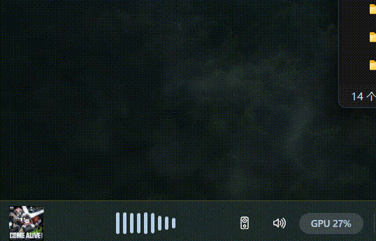
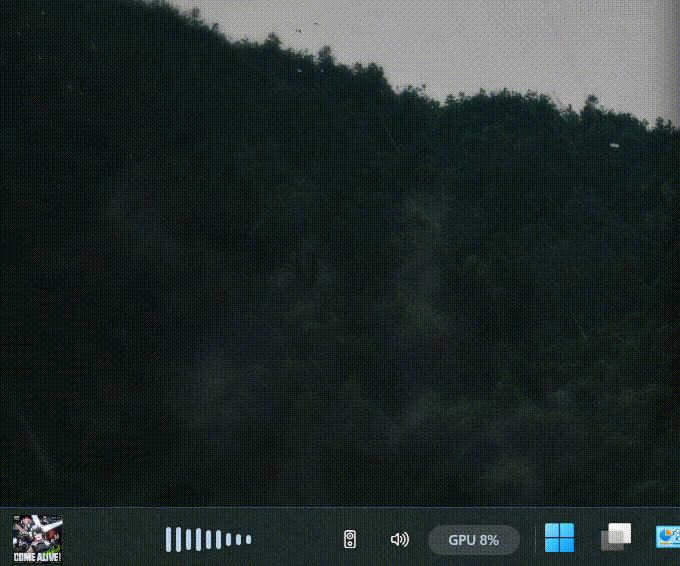
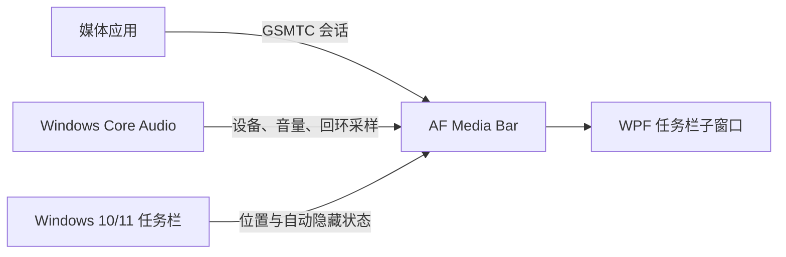

# AF Media Bar

<div align="center">

  <a href="https://github.com/Fervent-Tempo/AF-Media-Bar/releases">
    
  </a>
  <a href="https://github.com/Fervent-Tempo/AF-Media-Bar/releases">
    
  </a>
  <a href="https://github.com/Fervent-Tempo/AF-Media-Bar/stargazers">
    
  </a>
  <a href="https://github.com/Fervent-Tempo/AF-Media-Bar/issues">
    
  </a>
  <a href="LICENSE">
    
  </a>

  <br><br>

  

  <h1>AF Media Bar</h1>

  <p>Windows 10/11 任务栏上的媒体控制、音频设备切换与轻量系统指标。</p>

  <p>
    简体中文
    ·
    <a href="README.en-US.md">English</a>
    <br>
    <a href="#安装">快速开始</a>
    ·
    <a href="https://github.com/Fervent-Tempo/AF-Media-Bar/issues/new?template=bug_report.yml">报告问题</a>
    ·
    <a href="https://github.com/Fervent-Tempo/AF-Media-Bar/issues/new?template=feature_request.yml">功能建议</a>
  </p>

</div>

## 展示

### 运行展示



### 组件自定义



## 目录

- [展示](#展示)
- [简介](#简介)
- [功能](#功能)
- [工作方式](#工作方式)
- [安装](#安装)
- [使用](#使用)
- [更新与卸载](#更新与卸载)
- [常见问题](#常见问题)
- [技术限制](#技术限制)
- [隐私与安全](#隐私与安全)
- [从源码构建](#从源码构建)
- [项目结构](#项目结构)
- [TODO](#todo)
- [参与贡献](#参与贡献)
- [License](#license)

## 简介

AF Media Bar 是一款便携式 Windows 10/11 任务栏媒体控制器。它读取 Windows 全局系统媒体会话（GSMTC），显示当前媒体的封面、标题和作者，并提供上一首、播放/暂停、下一首和来源切换。

程序以独立进程运行，并将 WPF 播放器窗口挂载为任务栏子窗口，使其与任务栏自动隐藏动画同步；它不修改、不向 `explorer.exe` 注入代码。网易云音乐、QQ 音乐、Spotify、浏览器等应用只要向 Windows 发布媒体会话，就可以被发现和控制。

## 功能

| 类别 | 功能 |
| --- | --- |
| 媒体控制 | 显示封面、标题与作者；上一首、播放/暂停、下一首；切换多个媒体来源 |
| 来源交互 | 点击封面或标题切回媒体应用；在播放器区域滚轮切换来源 |
| 任务栏适配 | 手动拖动与锁定位置；实验性自动避让；支持任务栏自动隐藏与全屏隐藏 |
| 音频设备 | 查看并切换默认输出设备；悬停滚轮预览并延迟应用 |
| 应用音量 | 匹配当前媒体进程，在 Windows 音量合成器中按 2% 调节音量 |
| 音频可视化 | 基于 WASAPI 回环采样的九段频谱，可在收起状态显示 |
| 系统指标 | 可选显示系统内存、CPU、GPU 与 AF Media Bar 进程内存 |
| 低配置模式 | 使用 WPF 软件渲染并关闭过渡、滚动文字和指标淡入淡出 |

可用的命令取决于每个媒体应用程序通过GSMTC所提供的功能。
## 工作方式



Windows 11 控制中心里的媒体卡片是 Explorer/Shell 的内部界面，不是公开可嵌入的控件。AF Media Bar 复用其背后的公开 GSMTC 接口，并自行渲染界面，从而避免注入 Explorer 带来的稳定性和安全风险。

## 安装

### 系统要求

- Windows 10 版本 1809（内部版本 17763）或更高版本，x64
- 使用推荐的自包含版本时，无需另行安装 .NET

> [!IMPORTANT]
> 推荐在使用 AF Media Bar 时关闭 Windows 的“自动隐藏任务栏”。当前版本已经支持跟随自动隐藏任务栏，但出现和收回时的动画流畅度仍待提升；固定显示任务栏与全屏隐藏不受此限制。

### 推荐方式

1. 打开 [Releases](https://github.com/Fervent-Tempo/AF-Media-Bar/releases)。
2. 下载最新的 `AFMediaBar-vX.Y.Z-win-x64.zip`，不要下载 GitHub 自动生成的 Source code 压缩包。
3. 解压后会得到单个自包含的 `AFMediaBar.exe`，不再附带数百个 .NET 运行时文件。
4. 将它放到一个长期保留且可写的目录，例如 `%LOCALAPPDATA%\Programs\AFMediaBar`，然后运行。
5. 右键播放器或托盘图标，可配置开机启动、显示项目与定位方式。

AF Media Bar 当前是便携式程序，没有安装器，也不会写入系统目录。发布包暂未进行商业代码签名，因此 Windows SmartScreen 可能在首次运行时显示未知发布者提示。请只从本仓库 Releases 下载，并可使用同一 Release 中的 `SHA256SUMS.txt` 校验文件。

## 使用

| 操作 | 结果 |
| --- | --- |
| 悬停播放器 | 展开媒体控制区 |
| 点击上一首 / 播放 / 下一首 | 执行当前媒体会话支持的命令 |
| 点击封面或标题 | 切回当前媒体应用 |
| 在媒体区域滚轮 | 切换可用媒体来源 |
| 点击输出设备按钮 | 打开输出设备列表 |
| 在输出设备按钮上滚轮 | 预览设备，停止滚动 1 秒后切换 |
| 点击音量按钮 | 打开当前媒体应用音量滑杆 |
| 在音量按钮上滚轮 | 以 2% 步进调节应用音量 |
| 拖动封面或标题区域 | 调整手动位置；可在右键菜单中锁定 |
| 右键播放器或托盘图标 | 打开设置与退出菜单 |

媒体应用必须向 Windows 发布 GSMTC 会话。部分播放器需要在自身设置中启用“系统媒体控制”“媒体键”或“SMTC”。

## 更新与卸载

### 更新

1. 从托盘菜单退出 AF Media Bar。
2. 下载并解压新版本。
3. 用新的 `AFMediaBar.exe` 替换旧版本后重新启动。从 1.0.0 更新时，退出程序后可删除旧目录中的其余运行时文件。

位置、显示选项和开机启动配置保存在当前用户注册表中，替换程序文件不会丢失设置。

### 卸载

1. 在右键菜单中关闭“开机启动”，然后退出程序。
2. 删除 AF Media Bar 程序目录。
3. 如需同时清除设置，可在 PowerShell 中执行：

```powershell
reg.exe delete "HKCU\Software\AFMediaBar" /f
reg.exe delete "HKCU\Software\Microsoft\Windows\CurrentVersion\Run" /v "AF Media Bar" /f
```

## 常见问题

### 找不到正在播放的应用

确认应用正在播放媒体，并已启用系统媒体控制。浏览器只有在网页实际播放音视频时才会创建会话。来源不支持的按钮会自动禁用。

### 播放器遮挡了任务栏图标

默认使用手动定位。解锁位置后拖到任务栏空白区，再勾选“锁定手动位置”。自动避让仍是实验性功能，在定制任务栏或部分 Windows 更新中可能不准确。

### 输出设备切换失败

设备枚举使用 Windows API，但设置默认设备依赖未公开的 `PolicyConfig` COM 接口。Windows 更新、受管设备策略或特殊驱动可能阻止切换；这不会影响媒体控制功能。

### 应用音量匹配错误或不可用

音量控制按媒体会话来源匹配 Windows 音频会话。同一进程播放多个内容、浏览器多进程模型或播放器自定义音频引擎都可能导致无法唯一匹配。

### CPU、GPU 或内存占用偏高

关闭不需要的性能指标和音频可视化，或启用“低配置模式”。音频可视化会每 50 ms 读取一次 WASAPI 回环缓冲区。

## 技术限制

- AF Media Bar 是独立进程中的 WPF 窗口，通过 `SetParent` 挂载到 Explorer 任务栏；它不是 Explorer 内部插件，也不注入代码。
- Explorer 重启或第三方任务栏工具改变窗口结构时，程序需要重新发现并挂载任务栏窗口；特殊定制环境可能不兼容。
- 输出设备切换使用未公开的 Windows `PolicyConfig` 接口，未来 Windows 更新可能改变其行为。
- 自动定位依赖 Windows UI Automation；第三方任务栏工具、定制布局和系统更新可能影响识别。
- 自动隐藏任务栏模式下的跟随动画仍可能略有延迟，推荐关闭 Windows 的“自动隐藏任务栏”。
- 当前只跟随主显示器任务栏，不会在每个辅助显示器上分别创建控制器。
- 同一浏览器内多个网页如何呈现为 GSMTC 会话，由浏览器决定。
- 程序当前仅提供 `win-x64` 发布包，尚未提供 ARM64 构建。

## 隐私与安全

- 不包含遥测、广告、账号系统或联网分析代码。
- 媒体信息、系统指标和音量操作均在本机处理。
- 程序以当前用户权限运行，不请求管理员权限，也不向 Explorer 注入代码。
- 安全问题请按 [SECURITY.md](SECURITY.md) 私下报告，不要在公开 Issue 中披露利用细节。

## 从源码构建

需要 Windows 10 版本 1809 或更高版本、[.NET 8 SDK](https://dotnet.microsoft.com/download/dotnet/8.0) 和 PowerShell。

```powershell
git clone https://github.com/Fervent-Tempo/AF-Media-Bar.git
cd AF-Media-Bar
dotnet restore .\AFMediaBar.csproj
dotnet build .\AFMediaBar.csproj -c Release --no-restore
dotnet run --project .\AFMediaBar.csproj
```

生成供普通用户使用的自包含单文件：

```powershell
dotnet publish .\AFMediaBar.csproj -c Release -r win-x64 --self-contained true -o .\artifacts\AFMediaBar-win-x64
```

## 项目结构

```text
AF-Media-Bar/
|-- .github/
|   |-- ISSUE_TEMPLATE/     # Issue 表单
|   `-- workflows/          # 构建与发布工作流
|-- assets/                 # README 与品牌图片
|-- Interop/                # Windows 原生 API 互操作
|-- Models/                 # 媒体、音频、指标与任务栏数据模型
|-- Services/               # 媒体会话、音频、定位、托盘等服务
|-- App.xaml                # WPF 应用资源
|-- App.xaml.cs             # 应用启动与异常处理
|-- MainWindow.xaml         # 主界面布局
|-- MainWindow.xaml.cs      # 主窗口交互与状态协调
|-- AFMediaBar.csproj       # .NET 项目与发布配置
|-- app.manifest            # Windows 应用清单
|-- icon.ico                # 应用图标
|-- 运行展示.gif             # 运行效果演示
|-- 组件自定义.gif           # 组件配置演示
`-- README.md               # 中文说明
```

## TODO

- [x] 提升 Windows 自动隐藏任务栏模式下的跟随动画流畅度。
- [x] 完善自动避让任务栏图标功能。
- [x] Windows 10 适配测试。
- [ ] 窗口全局置顶。
- [ ] 提供无音频时自动隐藏选项。
- [ ] 自动适配系统主题。
- [ ] 提供悬浮窗口模式、自定义窗口大小、窗口竖向显示。
- [ ] 增加详细设置菜单界面。
- [ ] 视频字幕/歌词滚动展示。
- [ ] 歌曲进度条展示。
- [ ] 支持多种主题切换。
- [ ] 添加初始配置引导新手教程。

## 参与贡献

提交问题或代码前请阅读 [CONTRIBUTING.md](CONTRIBUTING.md)。错误报告请附 Windows 版本、AF Media Bar 版本、媒体播放器和完整复现步骤。

版本变化记录见 [CHANGELOG.md](CHANGELOG.md)。

## License

AF Media Bar 使用 [MIT License](LICENSE) 开源。

<div align="center">

如果 AF Media Bar 对你有帮助，可以给项目一个 Star。

</div>
