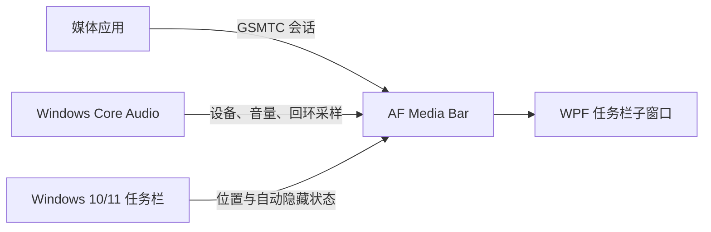

# AF Media Bar

<div align="center">

  <a href="https://github.com/Fervent-Tempo/AF-Media-Bar/releases"></a>
  <a href="https://github.com/Fervent-Tempo/AF-Media-Bar/releases"></a>
  <a href="https://github.com/Fervent-Tempo/AF-Media-Bar/stargazers"></a>
  <a href="LICENSE"></a>

  <br><br>

  

  <h1>AF Media Bar</h1>

  <p>Windows 10/11 任务栏上的媒体控制、实时歌词、音频设备切换与轻量系统指标。</p>

  <p>
    简体中文 · <a href="README.en-US.md">English</a>
    <br>
    <a href="#安装">快速开始</a> ·
    <a href="https://github.com/Fervent-Tempo/AF-Media-Bar/issues/new?template=bug_report.yml">报告问题</a> ·
    <a href="https://github.com/Fervent-Tempo/AF-Media-Bar/issues/new?template=feature_request.yml">功能建议</a>
  </p>

</div>

## 展示

[在 Bilibili 观看 AF Media Bar 介绍视频](https://www.bilibili.com/video/BV1Bjuq6bErr)

## 简介

AF Media Bar 是一款便携式 Windows 10/11 媒体控制器。它读取 Windows 全局系统媒体会话（GSMTC），把封面、标题、作者与实时歌词放进任务栏，并提供上一首、播放/暂停、下一首与来源切换；音频设备、应用音量、空间音效与系统指标也都在同一个界面里完成。

程序以独立进程运行，将 WPF 媒体栏挂载为任务栏子窗口，不修改、不向 `explorer.exe` 注入代码。网易云音乐、QQ 音乐、Spotify、浏览器等应用只要向 Windows 发布媒体会话，就可以被发现和控制。

## 功能

| 类别 | 功能 |
| --- | --- |
| 媒体控制 | 上一首、播放/暂停、下一首、循环；点击或拖动进度条跳转 |
| 来源交互 | 点击封面、标题/歌词可分别绑定播放/暂停、切回媒体应用或打开完整菜单 |
| 实时歌词 | 任务栏直接显示歌词并逐字擦亮，支持译文、音译与双行对齐；按网易云音乐、LRCLIB、QQ 音乐、酷狗音乐、汽水音乐依次匹配来源 |
| 任务栏适配 | 挂载为任务栏子窗口并自动避让图标与系统区域，可指定目标屏幕，无播放时可自动隐藏 |
| 外观与主题 | 字体、字号、浅色/深色、窗口材质与材质浓度全局统一；主题色可跟随系统强调色或自选 |
| 多层信息展示 | 悬停时显示控制按钮；打开完整层可显示全部信息 |
| 音频输出 | 支持使用点击/滚轮快速切换：默认输出设备、当前媒体应用音量、查看空间音效； |
| 快速启动 | 无媒体播放时点击/滚轮音符图标打开快速启动列表 |
| 频谱与性能 | 四种频谱样式、性能检测组件 |
| 当前播放通知 | 歌曲切换并开始播放时显示通知 |


媒体应用需要向 Windows 发布 GSMTC 会话才会被发现，部分播放器要先在自身设置里启用“系统媒体控制”或“媒体键”。当前运行模式只有任务栏：设置中的灵动岛、桌面卡片与悬浮球是占位选项，选中只切换该页显示。

## 工作方式



Windows 10/11 控制中心里的媒体卡片是 Explorer/Shell 的内部界面，不是公开可嵌入的控件。AF Media Bar 复用其背后的公开 GSMTC 接口并自行渲染界面，从而避免注入 Explorer 带来的稳定性与安全风险。

## 安装

### 系统要求

- Windows 10 版本 1809（内部版本 17763）或更高版本，x64；安装程序与便携版都自带 .NET 运行时，无需另行安装。
- 程序自身用到的系统接口在 1809 上就可用，但这些系统接口之外还有一层限制：**.NET 10 官方只支持 Windows 10 的长期服务版与企业版**（1809 E、21H2 E），消费版 Windows 10 能运行但不受 Microsoft 支持；Windows 11 不受影响。

### 方式一：安装程序（推荐）

1. 在 [Releases](https://github.com/Fervent-Tempo/AF-Media-Bar/releases) 下载 `AFMediaBar-Setup-vX.Y.Z-win-x64.exe`，不要下载 GitHub 自动生成的 Source code 压缩包。
2. 运行向导：先选**简体中文或英文**，再查看许可协议、**选择安装位置**、决定只为当前用户还是为所有用户安装（默认 `%LOCALAPPDATA%\Programs\AFMediaBar`，不需要管理员权限）。
3. 桌面快捷方式可选，开始菜单项始终创建。安装后即可启动；安装版支持程序内检查更新、后台下载并静默安装。

### 方式二：便携版

1. 在同一个 Releases 页面下载 `AFMediaBar-vX.Y.Z-win-x64.zip`。
2. 解压得到单个自包含的 `AFMediaBar.exe`，放到长期保留且可写的目录（例如 `D:\AFMediaBar`）即可运行；便携版不写注册表，升级时手动替换文件。

两种方式都只发布在 GitHub Releases。国内访问 GitHub 不稳定时，可在同一页面用 GH-Proxy 加速地址下载（`https://<加速站点>/https://github.com/...`）；程序内的更新检查与自动下载在直连失败时也会自动改用加速地址。

AF Media Bar 暂未进行商业代码签名，Windows SmartScreen 可能在首次运行或安装时提示未知发布者。

## 更新与卸载

### 更新

程序启动约 20 秒后读取公开版本清单（`docs/latest.json`）。发现新版本时：

- 托盘图标弹出一次系统通知，点击直接打开「应用」页；托盘与媒体栏右键菜单里也会出现随状态变化的更新入口。
- 该页显示版本亮点、下载进度与全部更新操作。
- 下载先直连 GitHub，提供「GitHub」与「加速镜像」两个下载页入口。便携版没有安装记录，只下载不安装。

安装日志在 `%LOCALAPPDATA%\AFMediaBar\updates\install-<版本>.log`；已下载的安装包放在同一目录，并在下次启动时按版本清理。

用户偏好与窗口状态保存在 `%LOCALAPPDATA%\AFMediaBar\settings.json`，同一版本内替换程序文件不会丢失设置；「应用」页可打开设置文件夹。

### 卸载

- 便携版：直接删除程序目录。
- 安装版：在“设置 > 应用 > 已安装的应用”中卸载，或使用开始菜单的卸载项；卸载只删除程序目录与快捷方式，需要使用下面命令或手动删除 `%LOCALAPPDATA%\AFMediaBar`。

```powershell
Remove-Item "$env:LOCALAPPDATA\AFMediaBar" -Recurse -Force
```

## 隐私与安全

- 不包含遥测、广告、账号系统或联网分析代码；媒体信息、系统指标与音量操作全部在本机处理。
- 更新检查只请求两个公开清单端点（`raw.githubusercontent.com` 与 jsDelivr 上的 `docs/latest.json`），不经第三方代理；安装包可能经清单里配置的加速地址下载，而它的 SHA-256 始终来自非代理端点获取的清单。
- 歌词按当前媒体信息向上述五个来源的公开接口请求（每个来源只发一次请求，命中即停止）；这些请求只发送曲名、歌手、专辑与时长，不上传设备信息或用户设置。
- 程序以当前用户权限运行，不请求管理员权限，也不向 Explorer 注入代码。安全问题请按 [SECURITY.md](SECURITY.md) 私下报告。

## 从源码构建

需要 Windows 10 1809 或更高版本、[.NET 10 SDK](https://dotnet.microsoft.com/download/dotnet/10.0) 和 PowerShell；仓库通过 `global.json` 固定受支持的 SDK 特性带。

```powershell
git clone https://github.com/Fervent-Tempo/AF-Media-Bar.git
cd AF-Media-Bar
dotnet restore .\src\AFMediaBar.slnx
dotnet build .\src\AFMediaBar.slnx -c Release --no-restore
dotnet test .\src\AFMediaBar.slnx -c Release --no-build
dotnet run --project .\src\AFMediaBar\AFMediaBar.csproj
```

生成供普通用户使用的自包含单文件：

```powershell
dotnet publish .\src\AFMediaBar\AFMediaBar.csproj -c Release -r win-x64 --self-contained true -o .\artifacts\AFMediaBar-win-x64
```

## 项目结构

```text
AF-Media-Bar/
├── .github/workflows/        # 构建与发布工作流
├── src/AFMediaBar/           # WPF 应用主项目
│   ├── Classes/              # 分层业务代码
│   │   ├── Abstractions/     # 跨模块契约
│   │   ├── Interop/          # Windows API 互操作
│   │   ├── Models/           # 数据模型（含布局 schema）
│   │   ├── Services/         # 按所有权分目录的服务（Media、Lyrics、Audio、Updates…）
│   │   ├── Settings/         # 设置模型与兼容门面
│   │   └── Utils/            # 无状态辅助与有界缓存
│   ├── Components/           # 可复用 WPF 控件
│   ├── Resources/            # 主题、样式与三语文案
│   ├── ViewModels/           # MVVM 视图模型
│   └── Views/                # 页面与宿主窗口
├── tests/AFMediaBar.Layout.Tests/   # 纯逻辑、策略与设置测试
├── tools/                    # 架构静态检查等脚本
├── installer/                # Inno Setup 安装脚本
└── docs/                     # 项目文档、资源与版本清单
```

## 参与贡献

提交问题或代码前请阅读 [CONTRIBUTING.md](CONTRIBUTING.md)。错误报告请附 Windows 版本、AF Media Bar 版本、媒体播放器与完整复现步骤。版本变化记录见 [CHANGELOG.md](CHANGELOG.md)。

## License

AF Media Bar 使用 [MIT License](LICENSE) 开源。

<div align="center">

如果 AF Media Bar 对你有帮助，可以给项目一个 Star❤️。

</div>

## 赞助

请作者喝杯咖啡。**大于 10 元的赞助可以进入赞助者名单，请在备注中留下 id。**

<div align="center">

| 微信 | 支付宝 |
| :---: | :---: |
|  |  |

爱发电赞助链接：[爱发电](https://ifdian.net/a/amorfate)

</div>
