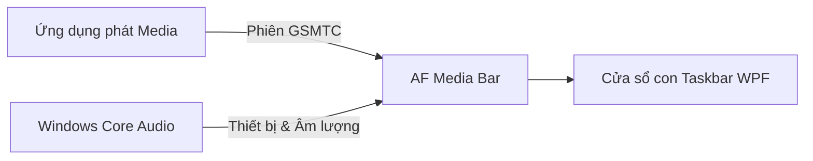

<p align="center">
  
</p>

<p align="center">
  <a href="https://github.com/Fervent-Tempo/AF-Media-Bar/releases"></a>
  <a href="https://github.com/Fervent-Tempo/AF-Media-Bar/releases"></a>
  <a href="LICENSE"></a>
  <br>
  <a href="README.md">简体中文</a> · <a href="README.en-US.md">English</a> · Tiếng Việt
  <br>
  <a href="#tải-về-và-khởi-chạy">Tải về</a> · <a href="#tính-năng">Tính năng</a> · <a href="https://github.com/Fervent-Tempo/AF-Media-Bar/issues/new?template=bug_report.yml">Báo cáo lỗi</a> · <a href="https://github.com/Fervent-Tempo/AF-Media-Bar/issues/new?template=feature_request.yml">Đề xuất tính năng</a>
</p>

AF Media Bar là một bộ điều khiển media tiện lợi dành cho thanh tác vụ (Taskbar) của Windows 10/11. Ứng dụng đọc phiên đa phương tiện của hệ thống để ghim ảnh bìa album, lời bài hát, các nút điều khiển phát nhạc và phím chuyển thiết bị âm thanh ngay sát cạnh màn hình desktop của bạn.

## Xem trước trực tiếp

<p align="center">
  
</p>

[Xem video giới thiệu trên Bilibili](https://www.bilibili.com/video/BV17yhh6aEgK)

## Tải về và khởi chạy

Truy cập mục [GitHub Releases](https://github.com/Fervent-Tempo/AF-Media-Bar/releases) và chọn gói cài đặt phù hợp:

1. **Bộ cài đặt (Khuyên dùng):** Tải tệp `AFMediaBar-Setup-vX.Y.Z-win-x64.exe`. Chạy trình hướng dẫn cài đặt để chọn ngôn ngữ, thư mục cài đặt và cài đặt cho người dùng hiện tại hoặc tất cả người dùng. Vị trí mặc định là `%LOCALAPPDATA%\Programs\AFMediaBar`. Phiên bản cài đặt hỗ trợ tự động kiểm tra, tải về và cài đặt các bản cập nhật.
2. **Bản Portable:** Tải tệp `AFMediaBar-vX.Y.Z-win-x64.zip`. Giải nén vào một thư mục cố định có quyền ghi (ví dụ `D:\AFMediaBar`), sau đó chạy `AFMediaBar.exe`. Để cập nhật bản portable, hãy thay thế tệp thủ công; tính năng khởi động cùng hệ thống sẽ ghi một mục khởi động vào registry của người dùng hiện tại.

**Khởi động cùng Windows:** Mỗi lần khởi động, ứng dụng sẽ đồng bộ công tắc trong trang Ứng dụng với mục Run trong registry cho đường dẫn thực thi hiện tại. Nếu thiếu mục đăng ký hoặc đường dẫn bị cũ, công tắc sẽ tự tắt mà không tự sửa chữa; hãy bật lại thủ công để đăng ký đường dẫn mới. Nếu không đọc được mục registry, cài đặt đã lưu vẫn giữ nguyên kèm thông báo trạng thái chưa xác định. Việc bật tắt công tắc hoặc đặt lại toàn bộ cài đặt sẽ áp dụng tương ứng. Trạng thái này không bao gồm cài đặt tắt ứng dụng khởi động của chính Windows, và ứng dụng không tự ý đảo ngược cài đặt tắt của Windows. Di chuyển tệp thực thi khi ứng dụng không chạy cũng sẽ ngăn ứng dụng tự sửa mục registry cũ.

**Yêu cầu hệ thống:** Windows 10 1809 (bản dựng 17763) trở lên, nền tảng x64, kèm theo Microsoft Edge WebView2 Runtime. Windows 11 và các bản cài đặt Windows 10 được hỗ trợ thông thường đã có sẵn; các bản Windows rút gọn cần cài đặt Evergreen Runtime trước. Cả hai gói phát hành đều đã tích hợp sẵn .NET runtime. Các giao diện hệ thống mà ứng dụng sử dụng đã khả dụng từ bản 1809, nhưng **.NET 10 chính thức chỉ hỗ trợ các phiên bản Windows 10 LTSC và Enterprise** (1809 E và 21H2 E); các bản Windows 10 người dùng thông thường nằm ngoài phạm vi hỗ trợ chính thức của Microsoft. Windows 11 hoàn toàn không bị ảnh hưởng.

Khuyến nghị tải gói phát hành (Release) thay vì tệp mã nguồn nén (Source code) tự động của GitHub. Do ứng dụng chưa có chữ ký số thương mại, Windows SmartScreen có thể hiện cảnh báo nhà phát triển không xác định trong lần chạy đầu tiên.

## Tính năng

| Khu vực | Chức năng có thể thực hiện |
| --- | --- |
| Điều khiển phát lại | Bài trước, phát/tạm dừng, bài tiếp theo, lặp lại, nhấp để chuyển đoạn hoặc kéo thanh tiến trình. |
| Lời bài hát trên Taskbar | Hiển thị lời bài hát trực tiếp qua công cụ web lyrics, kèm bản dịch nghĩa, phiên âm La-tinh và căn chỉnh hai dòng; ưu tiên tìm kiếm QQ Music trước và chấp nhận ngay nếu độ khớp từ 75 điểm trở lên; nếu không sẽ truy vấn song song các nguồn phụ và nguồn trùng với trình phát hiện tại sẽ được ưu tiên; trường hợp không có, kết quả điểm cao nhất sẽ được chọn (ưu tiên QQ khi bằng điểm), bao gồm cả việc xác nhận bài hát không có lời. |
| Nguồn phát và thao tác nhấp | Chuyển đổi giữa các phiên media; gán thao tác nhấp vào ảnh bìa hoặc tiêu đề/lời bài hát để phát/tạm dừng, mở ứng dụng phát nhạc hoặc mở menu đầy đủ. |
| Âm thanh và hệ thống | Nhấp chuột hoặc cuộn chuột để đổi thiết bị đầu ra mặc định, chỉnh âm lượng của ứng dụng phát nhạc hiện tại và xem trạng thái âm thanh không gian; 4 kiểu sóng nhạc phổ âm và thành phần theo dõi hiệu năng hệ thống. |
| Bố cục và giao diện | Tự động tránh biểu tượng Taskbar và khu vực khay hệ thống; chọn màn hình hiển thị, tự động ẩn khi không phát nhạc, tùy chỉnh phông chữ, màu nhấn (accent) và chất liệu nền cửa sổ. |
| Phím tắt & Thao tác nhanh | Di chuột để mở các nút điều khiển, mở bảng đầy đủ để xem thêm thông tin, dùng biểu tượng nốt nhạc hoặc menu chuột phải trên thanh media và khay hệ thống để khởi chạy nhanh, và chuyển nhanh thiết bị âm thanh. |

**Giới hạn:** Hầu hết các trình phát nhạc cần phát phiên GSMTC của Windows; một số trình phát yêu cầu bật tính năng "điều khiển đa phương tiện hệ thống" hoặc "phím media" trong phần cài đặt của chúng. NetEase Cloud Music còn có thể nhận diện thông qua đọc bộ nhớ RAM, bao gồm cả bản Store không có SMTC. Dữ liệu bộ nhớ được ưu tiên cho thông tin bài hát và lời bài hát; ảnh bìa và các nút điều khiển phát lại cần sự hỗ trợ của SMTC. Ảnh bìa chỉ được đọc từ SMTC chứ không tải về riêng; không hiển thị ảnh bìa nếu SMTC không có ảnh cho bài đó. NetEase xuất hiện một lần trong danh sách nguồn, và việc ẩn nguồn này khi bật bộ lọc nguồn sẽ dừng việc đọc bộ nhớ. Hiện tại Taskbar là chế độ chạy duy nhất; các mục Dynamic Island, Thẻ desktop và Bóng nổi trong Cài đặt hiện chỉ là vị trí chờ (placeholder).

## Cơ chế hoạt động

AF Media Bar chạy dưới dạng một tiến trình WPF độc lập và gắn thanh media như một cửa sổ con của thanh Taskbar. Ứng dụng sử dụng API Windows GSMTC công khai cho các phiên media và Windows Core Audio cho thiết bị cùng âm lượng. Ứng dụng **không chỉnh sửa hay can thiệp (inject code) vào tiến trình `explorer.exe`**.



NetEase Cloud Music, QQ Music, Spotify, trình duyệt web và các ứng dụng khác có thể được nhận diện và điều khiển khi chúng phát phiên media của hệ thống. Thẻ media của Windows không phải là một điều khiển có thể nhúng công khai; ứng dụng này đọc giao diện công khai phía sau nó và tự vẽ giao diện người dùng riêng trên Taskbar.

## Cập nhật và Gỡ cài đặt

### Cập nhật

Khoảng 20 giây sau khi khởi động, ứng dụng sẽ đọc bản kê manifest ổn định (`release/latest.json`) trên nhánh tách biệt `release-metadata`. Khi có phiên bản mới hơn, biểu tượng khay hệ thống sẽ hiển thị một thông báo hệ thống, nhấp vào sẽ mở trang Ứng dụng. GitHub Actions phát hành sẽ tự động tạo siêu dữ liệu; việc xem xét và nâng cấp phiên bản ổn định sẽ quyết định thời điểm kích hoạt. Nếu tệp `main/docs/latest.json` được giữ lại, các PR đồng bộ hóa sẽ cập nhật nó cho các máy khách cũ hơn. Xem thêm tại [Release CI](.github/workflows/release.yml).

Release CI cũng tạo các bản chụp nhanh (snapshot) danh sách người đóng góp, được kiểm duyệt cùng với bản kê phiên bản tại `release-metadata/release/contributors.json`. Ứng dụng vẫn ưu tiên thử GitHub contributors API trước và dự phòng bằng bản chụp nhanh đó; các PR đồng bộ sẽ duy trì `docs/contributors.json` trên nhánh main để đảm bảo tương thích. Danh sách nhà tài trợ `docs/sponsors.json` vẫn được duy trì thủ công trên nhánh main.
Bản portable không lưu nhật ký cài đặt nên chỉ hỗ trợ tải về.

Nhật ký cài đặt được ghi vào `%LOCALAPPDATA%\AFMediaBar\updates\install-<version>.log`, và các bộ cài đặt đã tải về nằm trong cùng thư mục này, được tự động dọn dẹp theo phiên bản trong lần khởi động tiếp theo.

Cấu hình tùy chọn và trạng thái cửa sổ được lưu tại `%LOCALAPPDATA%\AFMediaBar\settings.json`; việc thay thế các tệp chương trình trong cùng một phiên bản sẽ không bao giờ làm mất cài đặt, và trang Ứng dụng có sẵn nút mở thư mục cài đặt này.

### Gỡ cài đặt

- Bản Portable: Chỉ cần xóa thư mục chứa chương trình.
- Bản Cài đặt: Gỡ cài đặt từ Cài đặt Windows > Ứng dụng > Ứng dụng đã cài đặt (Installed apps) hoặc từ menu Start; thao tác này chỉ xóa thư mục chương trình và các lối tắt, do đó dữ liệu tại `%LOCALAPPDATA%\AFMediaBar` cần được xóa thủ công hoặc bằng lệnh PowerShell bên dưới:

```powershell
Remove-Item "$env:LOCALAPPDATA\AFMediaBar" -Recurse -Force
```

## Quyền riêng tư và Bảo mật

- Không thu thập dữ liệu từ xa (telemetry), không quảng cáo, không yêu cầu tài khoản hay phân tích hành vi; thông tin media, chỉ số hệ thống và các thao tác âm lượng đều được xử lý hoàn toàn cục bộ trên máy bạn.
- Tính năng kiểm tra cập nhật chỉ gửi yêu cầu tới hai địa chỉ manifest công khai (`release-metadata/release/latest.json` trên `raw.githubusercontent.com` và jsDelivr).
- Tìm kiếm lời bài hát sẽ thử QQ Music và yêu cầu lời bài hát trực tuyến trước; kết quả có điểm từ 75 trở lên sẽ được chấp nhận ngay. Nếu không, kết quả QQ sẽ được giữ lại trong khi truy vấn song song các nguồn dự phòng. Nguồn lời bài hát đã bật trùng khớp với trình phát hiện tại sẽ được ưu tiên bất kể điểm số; nếu nguồn bị tắt, thất bại hoặc không có kết quả, điểm số cao nhất sẽ được chọn (ưu tiên QQ khi bằng điểm). Tìm kiếm trực tuyến sử dụng thông tin tiêu đề và nghệ sĩ; một nguồn có thể gửi nhiều yêu cầu để tìm kiếm và lấy lời. Toàn bộ các nguồn đều có thể tắt trong Cài đặt.
- Ứng dụng chạy với quyền hạn của người dùng hiện tại và không yêu cầu quyền quản trị viên (Admin). Báo cáo các vấn đề bảo mật một cách kín đáo theo hướng dẫn tại [SECURITY.md](SECURITY.md).

## Biên dịch từ mã nguồn

Yêu cầu Windows 10 1809 trở lên, [.NET 10 SDK](https://dotnet.microsoft.com/download/dotnet/10.0) và PowerShell; kho lưu trữ cố định dải tính năng SDK được hỗ trợ thông qua `global.json`.

```powershell
git clone https://github.com/Fervent-Tempo/AF-Media-Bar.git
cd AF-Media-Bar
dotnet restore .\src\AFMediaBar.slnx
dotnet build .\src\AFMediaBar.slnx -c Release --no-restore
dotnet test .\src\AFMediaBar.slnx -c Release --no-build
dotnet run --project .\src\AFMediaBar\AFMediaBar.csproj
```

Để xuất bản tệp đơn tự chứa (self-contained single file) như bản phát hành chính thức:

```powershell
dotnet publish .\src\AFMediaBar\AFMediaBar.csproj -c Release -r win-x64 --self-contained true -o .\artifacts\AFMediaBar-win-x64
```

## Cấu trúc dự án

```text
AF-Media-Bar/
├── .github/workflows/        # Quy trình build và phát hành (CI/CD)
├── src/AFMediaBar/           # Ứng dụng WPF chính
│   ├── Classes/              # Mã nguồn phân tầng của ứng dụng
│   │   ├── Abstractions/     # Giao diện và hợp đồng giữa các mô-đun
│   │   ├── Interop/          # Tương tác với Windows Win32 API
│   │   ├── Models/           # Mô hình dữ liệu, bao gồm cấu trúc bố cục
│   │   ├── Services/         # Dịch vụ nghiệp vụ (Media, Lời bài hát, Âm thanh, Cập nhật…)
│   │   ├── Settings/         # Mô hình cấu hình và khả năng tương thích
│   │   └── Utils/            # Tiện ích trợ giúp không trạng thái và bộ nhớ đệm
│   ├── Components/           # Các điều khiển WPF có thể tái sử dụng
│   ├── Resources/            # Chủ đề, kiểu dáng và chuỗi ngôn ngữ đa ngữ
│   ├── ViewModels/           # Các ViewModel theo mô hình MVVM
│   └── Views/                # Các trang và cửa sổ giao diện
├── tests/AFMediaBar.Layout.Tests/   # Kiểm thử logic, chính sách và cài đặt
├── tools/                    # Kiểm tra tĩnh kiến trúc và kịch bản hỗ trợ
├── installer/                # Kịch bản đóng gói Inno Setup
└── docs/                     # Tài liệu hướng dẫn, tài nguyên hình ảnh và manifest phiên bản
```

## Đóng góp

Vui lòng đọc [Hướng dẫn đóng góp và định hướng dự án](CONTRIBUTING.md) trước khi mở một Issue hoặc Pull Request. Khi báo cáo lỗi, vui lòng nêu rõ phiên bản Windows, phiên bản AF Media Bar, trình phát nhạc đang dùng và các bước tái hiện lỗi chi tiết. Lịch sử thay đổi được ghi lại tại [CHANGELOG.md](CHANGELOG.en-US.md).

## Lời cảm ơn

Xin chân thành cảm ơn tất cả các nhà phát triển đã đóng góp cho AF Media Bar.

Đặc biệt cảm ơn các dự án mã nguồn mở sau:

- [FluentFlyout](https://github.com/unchihugo/FluentFlyout): Bảng điều khiển âm lượng Windows hiện đại và tinh tế.
- [Lyricify-Lyrics-Helper](https://github.com/WXRIW/Lyricify-Lyrics-Helper): Thư viện lời bài hát Lyricify để phân tích, tạo, tìm kiếm, giải mã và tinh chỉnh lời bài hát.
- [TaskbarLyrics](https://github.com/ANYNC/TaskbarLyrics): Công cụ hiển thị lời bài hát trên thanh Taskbar Windows.

## Giấy phép

AF Media Bar được phát hành theo [Giấy phép MIT](LICENSE).

<div align="center">

Nếu AF Media Bar hữu ích với bạn, hãy tặng một Ngôi sao (Star) trên GitHub nhé ❤️

</div>

## Tài trợ

Ủng hộ tác giả một tách cà phê. **Khoản tài trợ từ 10 CNY trở lên có thể tham gia danh sách nhà tài trợ — vui lòng để lại ID của bạn trong ghi chú thanh toán.**

<div align="center">

| WeChat | Alipay |
| :---: | :---: |
|  |  |

</div>
